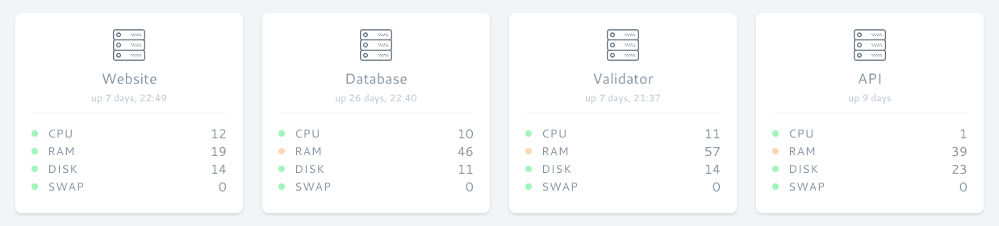

# Webtop
Webtop is a minimalistic Docker image to collect some basic host system metrics like CPU and RAM usage and display it va JSON API.

Example URL:

`http://localhost:9073`

Example Output:
```json
{
    "recorded_at": "2018-10-11 12:52:35",
    "uptime": "12:52:35 up  1:19,  load average: 1.38, 0.89, 0.70",
    "loads": [
        1.380859375,
        0.89453125,
        0.70947265625
    ],
    "cpu": 22.1201,
    "memory": {
        "total": 15716982784,
        "available": 8591216640,
        "used": 7125766144,
        "used_percent": 45
    },
    "swap": {
        "total": 2147479552,
        "available": 2147479552,
        "used": 0,
        "used_percent": 0
    },
    "disk": {
        "total": 205349539840,
        "available": 142812884992,
        "used": 62536654848,
        "used_percent": 30
    }
}
```

## Usage

Consider this docker-compose example:

```yaml

version: '3'

services:

  # your other services
  
  webtop:
    image: exbox/webtop:1.0
    ports:
    - "9988:80"
```

That's pretty much it, now auto-updating JSON should be available at `http://localhost:9988`.

If you need any basic auth, you can hide the service behind the web server of your choice.

## Dashboard Usage Example




## Webtop Sponsors

- **[AnyImage](https://anyimage.io/)**
- **[The Website Group](https://thewebsitegroupo.co.uk/)**

## Contributing

Any contributions are appreciated.

## License

Webtop is open-sourced software licensed under the [MIT license](https://opensource.org/licenses/MIT).